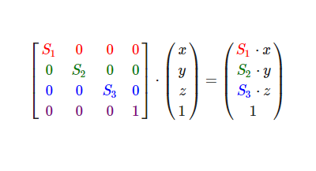
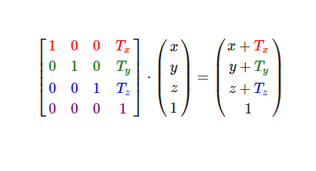
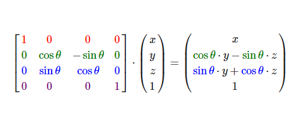
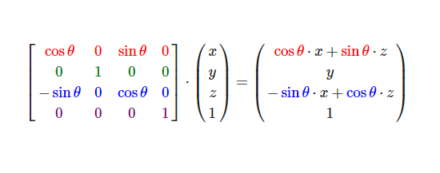
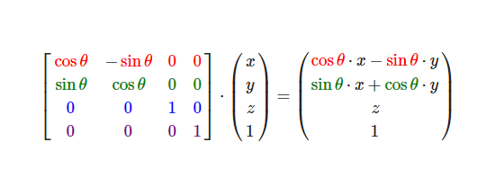
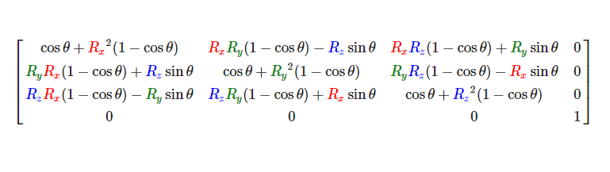

## 三维矩阵在opengl中的应用

### opengl中的坐标介绍

#### opengl中的窗口坐标


在opengl中我们所看到窗口如上图所示，是一个以中心为坐标原点，x和y分别从-1到1的一个笛卡尔坐标系。也就意味着，后续我们所讨论的坐标系的范围是[-1,1]

也许，大家在查看其它介绍opengl的书中，经常会有这样的说明，首先我们建立一个长为1920 宽为 1080的窗口，这句话的意思是说，把屏幕 1920 * 1080个像素点映射到 [-1,1] 这个范围内。也正因为如此，这样的窗口坐标，我们称之为 设备化标准坐标系

#### opengl 中的纹理坐标系


纹理坐标系是一个以左下角为原点，取值范围[0,1]的坐标系

### 窗口坐标系如何和纹理坐标系的关系

$$
\left[
\matrix{
 -1.0 & 1.0 & 0.0 & 0.0 & 0.0 & 0.0 & 0.0 & 1.0\\
 -1.0 & -1.0 & 0.0 & 0.0 & 0.0 & 0.0 & 0.0 & 0.0\\
 1.0 & -1.0 & 0.0 & 0.0 & 0.0 & 0.0 & 1.0 & 0.0\\
 1.0 & 1.0 & 0.0 & 0.0 & 0.0 & 0.0 & 1.0 & 1.0
 
}
\right]
$$

这是一个 4 * 7 的矩阵 ，接下来我们对于该矩阵的定义做一个说明 (矩阵的定义可以由开发者自行定义，这里采用的是比较传统普遍的定义方式) 

我们可以把这个矩阵看成是由三部分组成，当然这样写只是为了说明方便,实际上这样的表述是错误的:
$$
\left[
\matrix{
 -1.0 & 1.0 & 0.0 \\
 -1.0 & -1.0 & 0.0 \\
 1.0 & -1.0 & 0.0 \\
 1.0 & 1.0 & 0.0 
 
}
\right]
\left[
\matrix{
 0.0 & 0.0 & 0.0 \\
  0.0 & 0.0 & 0.0\\
 0.0 & 0.0 & 0.0\\
  0.0 & 0.0 & 0.0
 
}
\right]


\left[
\matrix{
0.0 & 1.0\\
0.0 & 0.0\\
1.0 & 0.0\\
1.0 & 1.0}
\right]
$$
首先我们要解释下这样的一个矩阵的行和列所代表的意义。

行代表物体的一个顶点的综合信息，由于我们绘制的是一个矩形，因而使用4个顶点便可以正确表示(实际在正确的绘制方式之中，由于是以三角形绘制的，需要6个顶点，这里不展开叙述)，由于在图形学中逆时针代表正向，后续所有讨论的顺序，均以该顺序作为标准。

列代表该顶点的一个属性, 可以看到这个矩阵一共有8列，每列分别代表

ox,oy,oz,r,g,b,tx,ty

ox：物体的x轴坐标

oy：物体的y轴坐标

oz:   物体的z轴坐标

r ： 物体的颜色r通道

g :    物体的颜色g通道

b：物体的颜色b通道

tx：纹理x坐标

ty：纹理y坐标

我们回过头看下前面叙述的设备化标准坐标系和纹理坐标系，就可以得到第一行所代表的意义
$$
\left[
\matrix{
 -1.0 & 1.0 & 0.0 \\
 }
\right]
$$
物体的左上角顶点和窗口的左上角顶点重合
$$
\left[
\matrix{
 0.0 & 0.0 & 0.0 \\
 }
\right]
$$
该顶点颜色为黑色,alpha信息该矩阵并没有给出，一般该属性会在glsl中进行定义
$$
\left[
\matrix{
0.0 & 1.0\\
}
\right]
$$
该顶点所对应的纹理坐标是(0.0,1.0) 也就是图片的左上角。

同理，其它几行也可以有类似的解释，读者可以尝试自行解释下。

ps: 运行程序看下效果.

### opengl中 图片的旋转 缩放 位移

我们看一下我们设置的window属性 1920 * 1080 

图片的属性 800 * 600 , 如果 按上述的方式设置，则意味着刚开始我们就对图片进行了拉伸使之铺满全屏,如果我们希望得到的效果是 

图片没有拉伸然后展示在图片的中心 或者 左上角，我们如何处理比较合适。

在解决这个问题之前，首先我们要确定一些东西，就是在opengl中，如果我们进行一个旋转，缩放，位移，那么它是什么东西作为参照物的。

在opengl中，我们常用类似于这样的方式进行物体的旋转，缩放和位移

```c++
glm::mat4 trans = glm::mat4(1.0f);
trans = glm::scale(trans, glm::vec3(0.5f, 0.5f, 0.5f));
trans = glm::translate(trans, glm::vec3(1.0f, 0.0f, 0.0f));
trans = glm::rotate(trans, glm::radians(45.0f), glm::vec3(0.0f, 0.0f, 1.0f));
```

上面的程序代表一个变化矩阵，如果大家还记得上一讲的内容，还记得这样的一个公式

M3 * M2 * M1 * V =（M3 * M3 * M1） * V

它意味着一个物体在坐标系中的运算，可以看成是物体经过M1，M2，M3三次变换，或者是先把变换进行求积，然后让物体进行一次变换。

在现在的场景中，V 就是我们上面的4*7 矩阵(确切的说是，该矩阵中和坐标有关系的部分)，M3 * M2 * M1 可以看成是trans 发生的一系列变化。

不知道大家看到这个公式后，直观上有哪些疑问？我这边直观的疑问是

1. 该变换所依赖的重心点是什么
2. 每个vec3中所代表的float的定义是什么
3. 如果运算顺序发生改变，我们所得到的结果是什么

为了回答这样的问题，我们做些简单的实验:

#### 原图


#### 只有scale


#### 只有Translate


#### 只有rotate


#### 结论

经过这三轮变化，我们做对比可以得出什么样的结论和认识？

1. 对于缩放来说，它缩放的大小，glm::vec3(0.5f, 0.5f, 0.5f)，中的0.5f指的分别是 x ，y，z 分别缩放到原来的0.5f，且缩放的中心点是图片的原点
2. 对于旋转来说，glm::radians(45.0f), glm::vec3(0.0f, 0.0f, 1.0f)，他所旋转的中心同样是图片的原因，角度逆时针为正45度，依据右手坐标系的原则，以z轴旋转
3. 对于位移来说，glm::vec3(1.0f, 0.0f, 0.0f)，看上去1.0f是窗口的一半，实际上也确实移动了一半。那么是不是可以下决定就是，所谓的平移就是指的是按照窗口的大小进行x/2.0f 的平移呢？

为了验证这个结论是否正确，我们再次做一个程序实验

```c++

glm::mat4 trans = glm::mat4(1.0f);
trans = glm::scale(trans, glm::vec3(0.5f, 0.5f, 0.5f));
trans = glm::translate(trans, glm::vec3(0.5f, 0.5f, 0.0f));
```

如果按照前面的推论，现在这样的变化结果应该是 1/4的图片 充满右上角，我们拿程序实验下：


结果和我们预想的不一样，感觉上这个0.5f 应该是图片缩放后的长度和宽度，由于所处在中心位置不太好看出来，因而我们先把图移到左上角，然后在处理。

这里我们修改图片初始的坐标，然后长宽取图片的真实的长宽800*600，因而所需要的矩阵是

```c++

	float trangle[] = {
		//lt color
		-1.0f,1.0f,0.0f,0.0f,0.0f,0.0f,0.0f,1.0f,
		//lb color
		-1.0f,-0.48f,0.0f,0.0f,0.0f,0.0f,0.0f,0.0f,
		//rb color
		0.33f,-0.48f,0.0f,0.0f,0.0f,1.0f,1.0f,0.0f,
		//rt color
		0.33f,1.0f,0.0f,0.0f,0.0f,0.0f,1.0f,1.0f
	};


```


我们使用相同变换方法：

```c++
trans = glm::translate(trans, glm::vec3(1.0f, 0.0f, 0.0f));
```


为了，解决弄清楚，translate的含义，我们回忆下上节关于缩放的定义，以(0,0)为原点不变，x，y分别缩小相关倍数。什么意思？


为了验证我们的结论，我们如果想让图片充满右上角，所需要的位移应该是(1.0f,1.0f)

```c++

glm::mat4 trans = glm::mat4(1.0f);
trans = glm::scale(trans, glm::vec3(0.5f, 0.5f, 0.5f));
trans = glm::translate(trans, glm::vec3(1.0f, 1.0f, 0.0f));
```

结果验证，证明结果是正确的。

现在我们弄明白了，先scale 在 translate的样式，那么如果我们先 translate，然后在scale 所得到的结果是什么样子的呢？

该结果可以由大家思考，然后得出结论。


由于先translate后，在做变换，会导致原点(0,0)的位置变化，因而在对物体做变形时，我们所采用的方式都是先 scale rotate 最后进行translate，这样是为了让分析任何问题，都基于同一个坐标系去考虑。


思考题：

1. 如果我想呈现一个左右相反的效果如何处理
2. 如果我想呈现一个左右上下都相反的效果何如处理
3. 如果我们对trans进行0.1的x轴缩小，我最终想呈现如下图的效果，我们所应该做的操作是什么？


### 添加观察矩阵

```c++

gl_Position = view * transform*vec4(aPos,1.0);

```

glsl中的position进行相关性的修改，我们可以看到物体的变换，是否两个矩阵相乘得出。那么，我们针对这种情况，我们需要 思考几个问题：

1. 先在tranform中 scale，再在view中scale，和直接在transform中scale 两次的结果是一致的么？
2. 现在tranform中translate，再在view中translate和，直接在transform中tranlate两次的结果是一致的么？
3. 如果一致，那这说明什么问题呢？

```c++

	glm::mat4 trans = glm::mat4(1.0f);
	trans = glm::scale(trans, glm::vec3(0.5f, 0.5f, 0.5f));
    glm::mat4 viewMat = glm::mat4(1.0f);
	viewMat = glm::scale(viewMat, glm::vec3(0.5f, 0.5f, 0.5f));

```


```c++
    glm::mat4 trans = glm::mat4(1.0f);
	trans = glm::scale(trans, glm::vec3(0.5f, 0.5f, 0.5f));
    trans = glm::scale(trans, glm::vec3(0.5f, 0.5f, 0.5f));


```

scale的结果一致

接下来，我们看下连续translate的情况

```c++
trans = glm::translate(trans, glm::vec3(1.0f, 0.0f, 0.0f));
trans = glm::translate(trans, glm::vec3(0.5f, 0.0f, 0.0f));


```

使用投影矩阵

```c++


glm::mat4 trans = glm::mat4(1.0f);
trans = glm::translate(trans, glm::vec3(1.0f, 0.0f, 0.0f));
glm::mat4 viewMat = glm::mat4(1.0f);
viewMat = glm::translate(viewMat, glm::vec3(0.5f, 0.0f, 0.0f));

```

运行程序，我们会发现所经过的变换是一致。


我们最后尝试一种比较复杂的情况，先scale 在rotate，然后在位移，我们分别使用trans 和观察矩阵来处理这样的变换

```c++


trans = glm::scale(trans, glm::vec3(0.5f, 0.5f, 0.5f));
trans = glm::rotate(trans, glm::radians(45.0f), glm::vec3(0.0f, 0.0f, 1.0f));
trans = glm::translate(trans, glm::vec3(1.0f, 0.0f, 0.0f));
glm::mat4 viewMat = glm::mat4(1.0f);


```


使用观察矩阵来做这些变换

```c++


glm::mat4 trans = glm::mat4(1.0f);
glm::mat4 viewMat = glm::mat4(1.0f);
viewMat = glm::scale(viewMat, glm::vec3(0.5f, 0.5f, 0.5f));
viewMat = glm::rotate(trans, glm::radians(45.0f), glm::vec3(0.0f, 0.0f, 1.0f));
viewMat = glm::translate(viewMat, glm::vec3(1.0f, 0.0f, 0.0f));


```


我们发现结果是一致的。其实，聪明的读者，估计在做实验之前就已经得出结论，肯定是一样的。为什么？ 因为所做的这些变化，本质上都是矩阵的乘法，且矩阵的乘法是满足乘法结合律的。

那么既然如此，我们需要思考下一个问题，既然所得到的结果一样，为何需要分得这么详细？为什么需要有view 矩阵 和 object 矩阵这种区分？

我思考了下，大致上是这么一个原因：

1. 在最终成像的时候，会存在很多object和很多视角。
2. 意味着可能出现的组合是 同一个视角有很多object 或者 同一个object有很多视角
3. 为了呈现这种不一样的显示结果，因而我们需要view 和 object。
4. 从大的方面来说，这其实就是一种编程思维，各司其职，排列组合


### 从观察矩阵和物体坐标矩阵回看矩阵乘法的意义

1. 有规律有约定的坐标变换 
2. 不同规律维度下所代表的含义值不一样
3. 不是因为公式去套用现实，而是使用现实去修改公式，使之在某个范围内合理(经典解释： 经典力学与量子力学)

opengl中的约定(二维三维中均有对应的关系存在)

1. 旋转定义
2. 缩放定义
3. 位移定义
4. 错切定义
5. 透视定义

图像变换只是这五种定义变换的排列组合，具体证明可参考资料

[深度剖析计算机图形学中的旋转](https://blog.csdn.net/u013407012/article/details/103721902/)

推荐算法中的矩阵定义

1. 维度比重
2. 维度附加
3. 维度组合

根据这些维度信息，匹配出正确的推荐


### 再议opengl中的旋转 与 位移

之前我们所讨论的数值范围，始终是x，y的坐标变换，如果我们考虑将z轴的坐标考虑进去，那么在opengl中这样的规则是什么样子的？


上图所显示的是opengl的坐标体系，遵循右手坐标法则（实际示范），

大拇指往右代表x轴的正方向

食指往上代表y轴的正方向

中指自然弯曲约90读，指向自己，代表z轴的正方向。

和以往一样，讨论任何一个坐标系，我们首先需要讨论两个要素：

1. 坐标系的原点坐标在哪里
2. 三个轴的正方向在哪里

请读者思考1mins后，然后以显示器作为参考要素进行作答。

坐标系的原点位于，屏幕中心

往右为x轴正坐标

往上为y轴正坐标

从屏幕往外为z轴正坐标


接下来，我们思考以下三种位移的情况，请大家给出答案

```c++
//设备化坐标体系
glm::mat4 trans = glm::mat4(1.0f);
//屏幕上会显示什么？ -1
trans = glm::translate(trans, glm::vec3(0.0f, 0.0f, 0.0f));
//屏幕上会显示什么？ -2
trans = glm::translate(trans, glm::vec3(0.0f, 0.0f, 1.0f));
//屏幕上会显示什么？ -3
trans = glm::translate(trans, glm::vec3(0.0f, 0.0f, -1.0f));

```

思考作答，然后给出结论


可以看到，这三种情况，都会显示一样的图像似乎并没有什么区别。

我们在尝试下以下两种情况的平移

```c++
//设备化坐标体系
glm::mat4 trans = glm::mat4(1.0f);
//屏幕上会显示什么？ -1
trans = glm::translate(trans, glm::vec3(0.0f, 0.0f, 1.01f));
//屏幕上会显示什么？ -2
trans = glm::translate(trans, glm::vec3(0.0f, 0.0f, -1.01f));


思考一下，会出现什么样的结果。
    
```


我们会发现，这时候窗口什么都没有显示了，为什么呢？其实大家有没有看到，我这里连续贴了两个坐标系的图，肯定是在暗示什么的。

我们看到，窗口的显示范围是[-1.0,1.0]，也就意味着在没有发生其它变换的时候，我们所能够看到的范围是[-1.0,1.0]，图上显示的是一个xy轴坐标系，它所展示的是一个平面，而我们现在探讨的是xyz的坐标系，也所展示的是一个空间，xyz的取值范围均为[-1.0,1.0],也就意味着我们所能看到的空间是一个立方体，其中原点(0,0,0)在显示屏的正中央。


在获得这样的信息后，我们再来做下关于旋转的测试与实验

```c++

glm::mat4 trans = glm::mat4(1.0f);
trans = glm::rotate(trans, glm::radians(45.0f), glm::vec3(1.0f, 0.0f, 0.0f));


```


请大家解释下呈现出这样的图的原因

```c++
glm::mat4 trans = glm::mat4(1.0f);
trans = glm::rotate(trans, glm::radians(45.0f), glm::vec3(1.0f, 0.0f, 0.0f));
trans = glm::translate(trans, glm::vec3(0.0f, 0.0f, 1.0f));


```


这样的结果，有没有和你想的不一样?仔细思考，回答这个问题，如果想不明白，我们看下下面的例子

```c++


glm::mat4 trans = glm::mat4(1.0f);
trans = glm::rotate(trans, glm::radians(45.0f), glm::vec3(0.0f, 0.0f, 1.0f));
```


```c++


glm::mat4 trans = glm::mat4(1.0f);
trans = glm::rotate(trans, glm::radians(45.0f), glm::vec3(0.0f, 0.0f, 1.0f));
trans = glm::translate(trans, glm::vec3(1.0f, 0.0f, 0.0f));
```


1. 所有的变换都是基于物体坐标系所做的变换，不能以窗口作为参考
2. 由于xyz取值的问题，会将视图一部分截掉，看不到


### 投影矩阵

这里只考虑透视投影矩阵，正交投影矩阵不在本次的讨论范围之内

看到这里，也许大家会说，这成像是多么的不真实，我们平时在生活中所看到的物体，都是近大远小，而所展示的demo并没有这种变化。

艺术来源于生活而高于生活，同样并不是矩阵决定了世界物体的样子，而是人们根据世界本身存在的样子进行了矩阵定义, 也就是我们接下来所要讨论的投影矩阵。

投影矩阵是为了展示更加真实的世界所定义出的一种矩阵，它通过特殊的算法，展示一种近大远小的真实感。

我们回味下，我们创建矩阵的时候，刚开始都会执行这样一段语句

```
glm::mat4 trans = glm::mat4(1.0f);
```

它的意思是创建一个标准化的齐次坐标矩阵
$$
\left[
\matrix{
 1.0 & 0.0 & 0.0 & 0.0 \\
 0.0 & 1.0 & 0.0 & 0.0\\
 0.0 & 0.0 & 1.0 & 0.0\\
 0.0 & 0.0 & 0.0 & 1.0
 
}
\right]
$$


 每行代表的含义分别为 

x 轴坐标

y 轴坐标

z 轴坐标

w 轴坐标

之前在第一讲中，我们讨论过3*3矩阵中和图片变换的矩阵因子，同样，在4* * 4 也存在这样的矩阵因子，这里我们只是做一个规律的展示，具体证明过程省略(具体证明涉及到大量的几何运算)。

缩放因子



位移因子



旋转因子

沿x轴



沿y轴



沿z轴



沿任意轴



大家仔细观察，我们对于一个向量不管是做什么样的变化，始终的考虑的是向量
$$
\left[
\matrix{
 x \\
 y \\
 z \\
 1 
}
\right]
$$
其实在实际的运算过程中，我们所需要考虑的向量为
$$
\left[
\matrix{
 x \\
 y \\
 z \\
 w 
}
\right]
$$
而向量的分向量w就是用于做投影效果，以实现近大远小的效果。

[数学关系](http://www.songho.ca/opengl/gl_projectionmatrix.html)

这个连接展示了，关w分量和最后在屏幕裁剪后的成像关系和证明。这里针对于证明不做多余的解释(其实我也不太会 - -! )

在opengl中投影矩阵是这样展示的

```c++
glm::mat4 projectionMat = glm::mat4(1.0f);
projectionMat = glm::perspective(glm::radians(45.0f), (float)screenWidth / (float)screenHeight, 0.1f, 100.0f);

```


fov : glm::radians(45.0f) 一般都定义成这样，如果想要一个末日风格的效果，该值可以大些

 (float)screenWidth / (float)screenHeight: 窗口宽高比

NEAR PLANE: 0.1f 

FAR PLANE: 100.0f 

只有在 NEAR 和 FAR 之间的物体才会被显示出来。

还记得我们一开始在讨论旋转位移时所做的实验么？

```c++
glm::mat4 trans = glm::mat4(1.0f);
//屏幕上会显示什么？ -1
trans = glm::translate(trans, glm::vec3(0.0f, 0.0f, -3.01f));

```

我们知道这样的程序，我们在屏幕上面，是看不到任何东西的，如果加入透视矩阵的效果，会是什么样子的呢？

```c++
glm::mat4 trans = glm::mat4(1.0f);
//屏幕上会显示什么？ -1
trans = glm::translate(trans, glm::vec3(0.0f, 0.0f, -3.01f));

glm::mat4 projectionMat = glm::mat4(1.0f);
projectionMat = glm::perspective(glm::radians(45.0f), (float)screenWidth / (float)screenHeight, 0.1f, 100.0f);


```


```c++
glm::mat4 trans = glm::mat4(1.0f);
trans = glm::rotate(trans, glm::radians(45.0f), glm::vec3(1.0f, 0.0f, 0.0f));
trans = glm::translate(trans, glm::vec3(0.0f, 0.0f, -3.0f));

glm::mat4 projectionMat = glm::mat4(1.0f);
projectionMat = glm::perspective(glm::radians(45.0f), (float)screenWidth / (float)screenHeight, 0.1f, 100.0f);

```

改变，radians 的值，进行思考和解释。

问题：

如果我们希望得到如下图的效果，应该如何处理？


```c++

glm::mat4 trans = glm::mat4(1.0f);
trans = glm::translate(trans, glm::vec3(0.0f, 0.0f, -3.0f));
trans = glm::rotate(trans, glm::radians(45.0f), glm::vec3(1.0f, 0.0f, 0.0f));

glm::mat4 projectionMat = glm::mat4(1.0f);
projectionMat = glm::perspective(glm::radians(45.0f), (float)screenWidth / (float)screenHeight, 0.1f, 100.0f);

```

到此为止，大家大致了解了opengl中的三大矩阵变换，以及相关变换细节。

本次分享还有最后一点内容:

#### 使用另一种观点 去阐述矩阵变换

本篇前面所阐述的体系，建立于坐标点会改变的前提下，接下来的理论建立在坐标原点始终不变的前提下，两种解释均是正确的，具体怎么理解，以及何时使用哪种方式处理，需要根据具体实际情况来处理

#### 如果获得变换后的最终坐标

#### 下次分享主题(投票选择)

1. 矩阵在图像识别中的应用
2. opengl中的光照基础