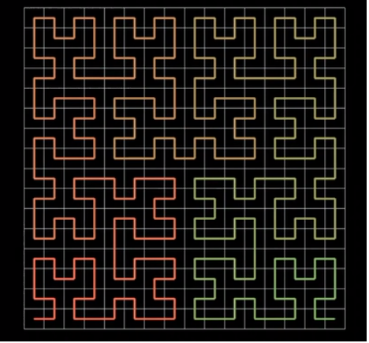

# 计算机中的矩阵应用（1）

​															二维坐标系中的运用

## 引言

其实在从事android开发中，最先接触矩阵的时候，是在使用Imageview的时候，有个matrix属性，一直不怎么理解这个属性和图片有什么关系，为什么在代码中通过设置这个matrix的相关属性，就可以改变这个imageview的大小或者位置。本文将会针对于这个问题进行解答。

#### 图片在计算机中的展现

有点编程基础的人都知道，我们在读写图片的时候，都会使用字节流进行读取，那么图片和字节流是什么样的关系呢？让我们先来看一段视频:

<video src="./video/matrix_lion.mp4" width="800px" height="600px" controls="controls"></video>

从视频中我们可以看到，一张图片(狮子)是做了怎样的转换最终被保存在计算机的数组中。其中白色的曲线叫做希尔伯特曲线，该曲线由无数的点组成，如果加上一些方框图，如下图所示：

不觉得和我们平时所见的坐标系很像么？也就是说，希尔伯特曲线可以被表示为N个(x,y)坐标点的数组，从而说明，一张图片可以转换成N个坐标点来展示。

## 向量与坐标

#### 向量的定义与组成
有方向和大小的量叫做向量，它有两个要素，方向和大小。

如图所示，i是一个向量，其中，x=-2，y=3. 我们用下面的方式表示
$$
i = \left[
\matrix{
  -2 \\
  3 \\ 
}
\right]
$$

我们可以理解为 i 是由原点(0,0)指向(-2,3)的向量，如果我们约定所有的向量的起点均来自于原点(0,0),那么向量i 可以用坐标点(-2,3)来表示。这样就把一个向量转变成了坐标点。

#### 向量的加法

$$
i = \left[\matrix{  1 \\  2 \\ }\right]
j = \left[\matrix{  3 \\  -1 \\ }\right]
$$

i+j = ? , 根据我们大学里面学的知识，我们知道 向量的计算是 x 和 y 分别相加 即：
$$
i+j = 
\left[\matrix{  1+3 \\  2+(-1) \\ }\right] 
= 
\left[\matrix{  4 \\  1 \\ }\right]
$$
那么为什么是这样:

两个向量的加，代表的是 最终所处的位置，大家简单理解为，自己首先在原点，向

(1,2)的方向，走|i|的距离，然后向(3,-1)的方向走|j|的距离。

这个过程也可以理解为，先把X的距离走完，在把y的距离走完。如下图所示：

#### 向量与标量的乘法

$$
2* i 
= 
2\left[\matrix{  1 \\  2 \\ }\right]
=
\left[\matrix{  1*2 \\  2*2 \\ }\right]
=
\left[\matrix{  2 \\  4 \\ }\right]
$$

可以使用两个一样向量进行加法验证，这里省略证明步骤，这里需要指出的是，针对于(2,4)这个坐标点，我们可以看成是 2*(1,2) 这个思想很重要，在下面的说明中，会再次提起这个概念。

#### 向量与向量的乘法

本次说明，将会省去该部分的讲解，几何意义是一个向量在另一个向量方向的投影，省去该部分，是因为，这部分在本次关于矩阵在计算中的运用意义并没有得到体现，等到后续有了应用场景后，在对该块内容进行说明。

#### 坐标系

如果所示，这是一个大家常见的坐标系，我想在座的应该没有不认识的吧。在这个坐标系中，有两个非常有用的并且重要的坐标向量
$$
i=\left[\matrix{  1 \\  0 \\ }\right]
j=\left[\matrix{  0 \\  1 \\ }\right]
$$
我们把它叫做单位向量或者基向量，对于坐标系的任何一个向量都可以用基向量表示。如
$$
\left[\matrix{  3 \\  -2 \\ }\right]
=
3\left[\matrix{  1 \\  0 \\ }\right]
+
-2\left[\matrix{  0 \\  1 \\ }\right]
=3i+(-2)j
$$

#### 线性定义以及矩阵乘法的意义

思考这么一个问题，为什么我们说矩阵的时候，为什么要叫做线性代数呢？其实叫这个名字，是将矩阵的性质做了一个限制：线性。那么什么是线性，我们研究的矩阵中的线性有哪些条件。

1. 坐标原点不会发生改变。 即：无论坐标轴如何发生改变，原点始终是(0,0)
2. 坐标轴发生拉伸或者旋转后，等分的距离保持一致。

<video src="./video/linear.mp4" width="800px" height="600px" controls="controls"></video>

也就是说，后续关于矩阵的讨论，均在这两个条件范围内。

那么根据这个特性，我们可以得到什么样的结论:

假设在变换之前，基向量是i和j ，那么任意向量可以表示为

a=mi+nj 即
$$
a
=
m\left[\matrix{  1 \\  0 \\ }\right]
+
n\left[\matrix{  0 \\  1 \\ }\right]
=mi+nj
=\left[\matrix{  m \\  n \\ }\right]
$$

由于，i和j是标准的基向量，因而我们将该标准基向量进行省略

假设变换之后的, 基向量是i',j',那么任意向量可以表示为

a'=mi'+nj' 即
$$
a'
=
m\left[\matrix{  x \\  y \\ }\right]
+
n\left[\matrix{  x' \\  y' \\ }\right]
=mi'+nj'
$$

我们仔细分析上下两个的区别，可以得出这样的结论，就是变换过后，真正发生的改变，只是基向量，也就意味着，我们可以把任意向量的变化 拆解成两个步骤：

1. 基向量的变化
2. 对于变化后的基向量使用m,n进行相关维度的处理变化

其中
$$
i'
=
x\left[\matrix{  1 \\  0 \\ }\right]
+
y\left[\matrix{  0 \\  1 \\ }\right]
=
xi+yj
$$

$$
j'
=
x'\left[\matrix{  1 \\  0 \\ }\right]
+
y'\left[\matrix{  0 \\  1 \\ }\right]
=x'i+y'j
$$

为了做相关区分，我们把它写为(这里我们把标准基向量进行了省略)：
$$
i'
=
a\left[\matrix{  1 \\  0 \\ }\right]
+
b\left[\matrix{  0 \\  1 \\ }\right]
=
ai+bj
=
\left[\matrix{  1 & 0 \\  0 & 1 \\ }\right]
\left[\matrix{  a \\  b \\ }\right]
=
\left[\matrix{  a \\  b \\ }\right]
$$
同理，对于j',我们可以写为
$$
j'
=
c\left[\matrix{  1 \\  0 \\ }\right]
+
d\left[\matrix{  0 \\  1 \\ }\right]
=ci+dj
=
\left[\matrix{  1 & 0 \\  0 & 1 \\ }\right]
\left[\matrix{  c \\  d \\ }\right]
=
\left[\matrix{  c \\  d \\ }\right]
$$
由于，a'=mi'+nj',那么
$$
a'
=
m\left[\matrix{  a \\  b \\ }\right]
+
n\left[\matrix{  c \\  d \\ }\right]
=
\left[\matrix{  ma+nc \\  mb+nd \\ }\right]
$$
为了书写方便，在现代函数的领域中，我们将之表示为:
$$
\left[\matrix{  a & c \\  b & d \\ }\right]
\left[\matrix{  m \\  n \\ }\right]
$$
哇，这时候你发现了什么？这不就是我们常见的矩阵乘法，它的运算规则，就是上图所示。自然，我们可以使用另外一种计算方式去计算该结果是否正确。最终，我们会发现，答案是完全一致。

恩，我们暂停一下，我们思考下，我们是做了什么？得到这样的结论，思考下，恩.... 我们前面是在讨论线性的定义，然后讨论在线性定义下，发生了转换，然后推导出....转换可以看成是基坐标的转换...然后....

说到这里，大家是不是意识到了什么？对了，在线性领域，坐标系中的向量发生变化，可以看成是一个矩阵的乘法，我们把这种形式的乘法，叫做矩阵的点乘。这样的一个论述，阐述了向量(点)的变化可以看成是一个矩阵的乘法的诞生过程。

#### 矩阵变换的衍生

针对于表达式
$$
\left[\matrix{  a & c \\  b & d \\ }\right]\left[\matrix{  m \\  n \\ }\right]
$$

我们设
$$
M 
=
\left[\matrix{  a & c \\  b & d \\ }\right]
V
=
\left[\matrix{  m \\  n \\ }\right]
$$

其中V表示需要变换的向量，M表示基坐标的转换，也叫作变换矩阵。那么对于任一在坐标系中的任意向量V，它的线性变换可以看成是

M*V

如果V经过多次变换M1，M2，M3，那么最终的变换结果为

V’=M3 * M2 * M1 * V

看到这里大家会有个疑问，为什么我们的表达是 

M3 * M2 * M1 * V 而不是 V * M1 * M2 * M3呢，如果要回答这样的问题，我们不得不扯出函数的概念。

函数
$$
f(x)=x+1
$$

$$
g(f(x))=?
$$

大家是不是看懂了什么？其实函数是将一个输入经过一个函数，变成另一个输出的过程。线性变换也是一种特殊的函数，之所以不叫线性函数，而叫线性变换，是因为，它有直观的几何意义。（上面的视频有所体现，如果大家想了解更多 推荐大家观看[线性代数的本质](https://www.bilibili.com/video/BV1Ys411k7yQ?from=search&seid=9243191448739032345)）

对于V‘，我们所做的操作先 将V 经过M1变换，在经过M2变换，在....

为了和函数的写法一致(因为线性变换本身属于函数的一种)

我们会写成

V'=M3 * M2 * M1 * V

且计算的顺序是从右往左，而不是从左往右。

现在有个问题大家思考下：

M3 * M2 * M1 * V 和 （M3 * M3 * M1） * V

这两个的结果是否一致？答案是一致的，当然你可以通过复杂的运算来处理。但是这里我希望用几何基坐标的思想去解释。

第一个指的是 V 先经过 M1，得到M1中的V’，然后V‘ 在经过M2..... 最终经过M3 得到最终的变换结果

第二个理解为 不去思考V的情况，只对基坐标进行变换处理...等处理完毕后，得到一个最终确定的基坐标，然后在用V进行该基坐标的转换。

按照我们前面关于线性的理解，对于向量转换，可以看成是基坐标的转换，可以得出这两个变化的最终结果肯定是相同的。恩，暂停下，大家仔细思索下这句话的含义，我想每个人都会获得不一样的见解。

#### 图像的变化其实是无数个向量的坐标变换

仔细回味下我们讲解的所证明的东西

1. 图片可以使用希尔伯特曲线无线细分，从而转换成无数个点
2. 在坐标系中，任何一个向量，都可以看成是一个点
3. 对于坐标系中的任何一个点，它的变换都可以看成是基向量的变换，即 任何一个点通过矩阵乘法实现线性变换

仔细回味下，点通过矩阵乘法实现线性变换，图片由无数的点组成，那么可以得出结论，图片可以看成是无数个点进行矩阵乘法。即，图片的变换行为，由变换矩阵M，所决定。

#### 变换矩阵M影响因子

##### scale(缩放)

首先我们看下标准基向量
$$
\left[\matrix{  1 & 0 \\  0 & 1 \\ }\right]
$$
其中(1,0)是 标准基x分量 i, (0,1) 是标准基y分量j .

假设我们需要对于x放大m倍，也就是说y分量不能受影响
$$
m*i
=
m*\left[\matrix{  1  \\  0 \\ }\right]
=
\left[\matrix{  m \\  0 \\ }\right]
$$
同理我们对于y放大n倍
$$
n*j
=
n*\left[\matrix{  0  \\  1 \\ }\right]
=
\left[\matrix{  0 \\  n \\ }\right]
$$
我们把它组合起来
$$
\left[\matrix{  m & 0  \\  0&n\\ }\right]
$$
也就说明了和放大有关系的是　ｍ，ｎ，其中ｍ控制x的scale，n控制ｙ的scale

##### rotation(旋转)

我们先来看个示意图，在矩阵中旋转是什么样的效果

图上，黑色的代表的是原坐标系，红色代表的是x轴旋转后的位置，绿色代表的是y轴旋转后的位置。这个图表示的是坐标轴按照逆时针的方向旋转θ角度，在矩阵运算中，逆时针旋转为正(+),顺时针旋转为负(-)。

根据图我们可以计算出基向量的变化
$$
\left[\matrix{  cosθ &  cos(\pi/2+\theta) \\  sinθ & sin(\pi/2+\theta)\\ }\right]
$$
根据三角函数的转换公式，我们转换为
$$
\left[\matrix{  cosθ &  -sin\theta \\  sinθ & cos\theta\\ }\right]
$$
也就意味着，如果我们想要让一个基坐标进行旋转，那么我们传入的值，满足上述的样式即可。

##### skew(错切)

我们看几张图了解下错切的表现形式，

可以看到，错切是把图片进行了扭曲，一般来说，错切分为两个方向，沿着X轴的错切和沿着Y轴的错切。

这张图展示的是沿着X轴进行错切，它的方式是，x轴保持不变，然后y轴按照顺时针的方向(和旋转相反)进行偏转。

同理沿着Y轴进行错切，表现形式应为

大家可以简单的理解为，旋转是整个坐标轴进行θ角度的旋转，而错切是在其中一个轴保持不变的情况下，另一个轴沿着不动轴方向进行旋转所产生的矩阵变换。
$$
\left[\matrix{  1 &  0 \\  tan\alpha & 1\\ }\right]
\left[\matrix{  1 &  tan\beta \\  0 & 1\\ }\right]
=
\left[\matrix{  1 &  tab\beta \\  tan\alpha & 1\\ }\right]
$$
侧切可以看成是先skewx在skewy的变换，即 My * Mx

也可看成是先处理基向量变换， 即 Myx

然后在和向量做变换的过程 

##### Translate(平移)

也许看到这里，你会觉得奇怪，为什么把平移放到这个位置在讲解，因为在平时的开发中，我们总是会先处理平移，而且平移也是比较好理解的过程。之所以，把平移放到这里讲是因为，我们回顾下前面的几种变换

scale,rotate,skew 它们都有一个很明显的共同点，就是无论怎么发生变换，原点始终保持不变。根据我们的理论，任何向量的变换，可以看成是 基向量的变换，如果我们处理平移，意味着基向量要发生平移，从而导致原点发生变换。

其次我们在思考一个事情，二维中的点，能否让坐标系中发生移动？答案显然是不能的。如果想要二维坐标系的原点发生移动改变，即二维的根基发生改变，我们必须要站在三维的角度去看这个问题，这也就意味着，如果要考虑移动的因素，我们的基向量组不仅仅是i j ，还需要有一维专门用来表示平移，用矩阵来表示将是
$$
\left[\matrix{  1 &  0 & 0\\ 0 & 1 & 0\\ 0 & 0 & 1}\right]
$$

由于我们约定用第三列来表示平移的位置，那么我们矩阵运算规则来计算下，看看是否和我们这样约定吻合
$$
\left[\matrix{  1 &  0 & Tx\\ 0 & 1 & Ty\\ 0 & 0 & 1}\right]
*
\left[\matrix{  x\\ y\\ 1}\right]
=
\left[\matrix{  1 *x +0*x+Tx*x &  \\ 0*y+1*y+Ty*y\\0*x+0*y+1*1 }\right]
=
\left[\matrix{  1 *x +Tx*x &  \\ 1*y+Ty*y\\ 1}\right]
$$
可以看出来结论是吻合的，从数学角度来说x的偏移量为Tx，y的偏移量为Ty

#### 坐标系内中的锚点计算

绕原点的旋转是二维旋转方式中最基本的情况，如果我们需要进行绕任一点的旋转，我们需要如何去做，经过大量计算和科学实验，得出以下的结论和步骤：

1. 首先讲旋转点移动到原点处
2. 进行旋转
3. 讲旋转点移回到原处

假设旋转点是 （Tx，Ty）,那么我们可以构建的基向量矩阵变换是

将旋转点移动到原点 M1
$$
\left[\matrix{  1 & 0 & -Tx\\ 0 & 1 & -Ty\\ 0 & 0 & 1}\right]
$$
旋转矩阵 M2
$$
\left[\matrix{  cos\theta & -sin\theta & 0\\ sin\theta & cos\theta & 0\\ 0 & 0 & 1}\right]
$$

将旋转点移回到原位 M3
$$
\left[\matrix{  1 & 0 & Tx\\ 0 & 1 & Ty\\ 0 & 0 & 1}\right]
$$

结合起来
$$
M
=
\left[\matrix{  1 & 0 & Tx\\ 0 & 1 & Ty\\ 0 & 0 & 1}\right]
\left[\matrix{  cos\theta & -sin\theta & 0\\ sin\theta & cos\theta & 0\\ 0 & 0 & 1}\right]
\left[\matrix{  1 & 0 & -Tx\\ 0 & 1 & -Ty\\ 0 & 0 & 1}\right]
$$

#### 结语

图片是由无数点组成，向量可以看成起点是原点，终点是某个坐标的点。

一个向量可以由i , j 这样的基向量组成

向量的变换可以看成是 基坐标i ,j的变换过程

通过各种变换矩阵的M的相乘，可以得出最终变换的基向量i',j'

根据i‘ ，j' 可以推出向量的最终变换，从而可以推导出 图片的变换

